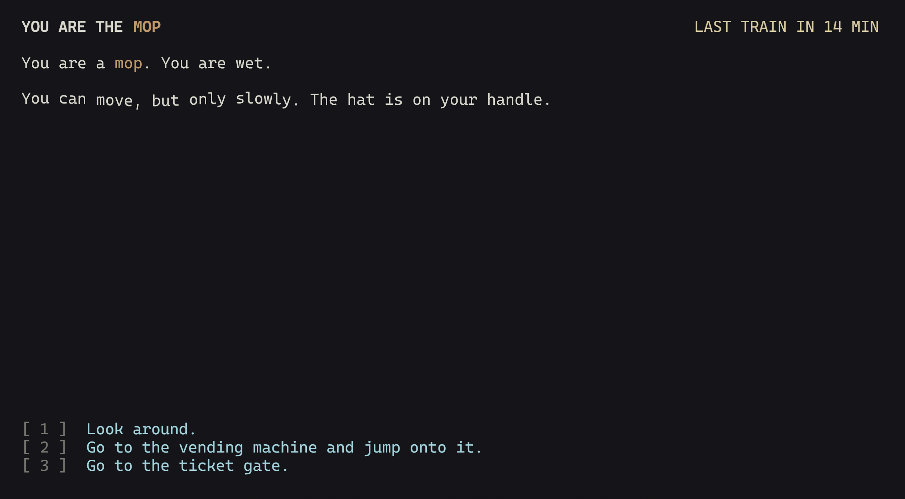

# Lost & Found

Author: Deming Xu

Design: You are a hat. Someone left you in the lost-and-found box of a train station, and the last train leaves in fifteen minutes. A hat cannot walk, but it can jump onto a thing and become that thing. Each body (a mop, a vending machine, a guard, a pigeon) can do different things, so the choices change every time you jump.

Text Drawing: Text is drawn at runtime. Words can get thicker and thinner in a wave, move up and down, or shake. At startup, FreeType renders every printable ASCII character of a variable-weight monospace font (Cascadia Mono) at many weights into one texture. Because the font is monospace, every character gets a cell of the same size. To draw a thicker or thinner letter, the game just uses a different cell. HarfBuzz turns each string into glyph indices and advances. The game wraps lines and draws all the text on screen with one draw call. Every effect is a per-character setting: weight picks the cell, shake and wave move the quad, color is the vertex color. Code: `TextRenderer.cpp`, `TextProgram.cpp`.

Choices: Each screen has two or three sentences and two or three choices. Extra information (what you remember, what is around you) is shown only if you ask for it. The story is written in [`story.xml`](story.xml). A node has paragraphs, style tags (`<b>`, `<pulse>`, `<shake>`, `<wave>`, `<c name="color">`), and choices. A choice can cost minutes, set a flag, or require a flag. A `<look>` element is a side note: the compiler makes it a separate node with one "Back." choice, so it does not add to the main list. [`compile_story.py`](compile_story.py) converts the XML into `dist/story.bin`, a chunked binary file that the game reads with `read_chunk`. The tags are not in the file: each node's text is stored as plain text, and next to it is a list of style runs, each saying "bytes 10 to 19 are bold and yellow". The rest of the file is a table of nodes (text range, style range, up to four choices) and the string pool. The game does not parse any text at runtime. To change the story, edit `story.xml` and run `python3 compile_story.py story.xml dist/story.bin`.

Screen Shot:

How To Play:

Press 1, 2, 3 or 4 to choose. The choice happens when you release the key. Press R to start over. Moving costs one minute. Looking around is free. There are five endings. Only one of them is the right head.

Sources:
- [Cascadia Mono](https://github.com/microsoft/cascadia-code) by Microsoft, SIL Open Font License 1.1 (`dist/README-CascadiaMono.txt`).

This game was built with [NEST](NEST.md).
